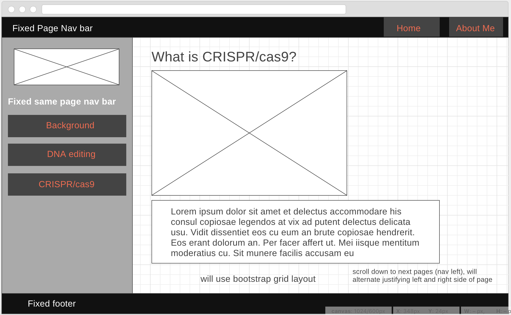

# Learn Crispr-cas9

This project describes the basics of gene editing with the newly discovered gene editing tool, Crispr-cas9.

## Built With

* [Atom](https://atom.io/)
* [Google Fonts](https://fonts.google.com/)
* [FlatIcon](https://www.flaticon.com/)
* [Bootstrap](https://getbootstrap.com/)

## Languages used:

* HTML
* CSS

## Deployed link

learn-crispr-cas9.surge.sh

## Screenshot of Wireframe

## Screenshot of Website

